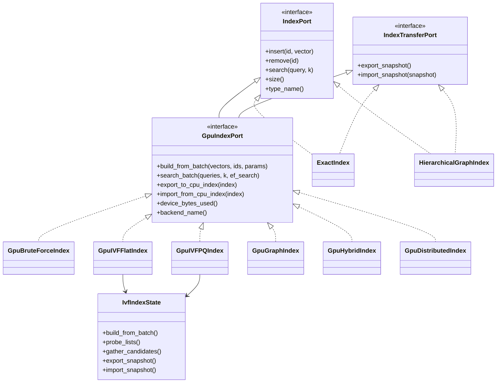
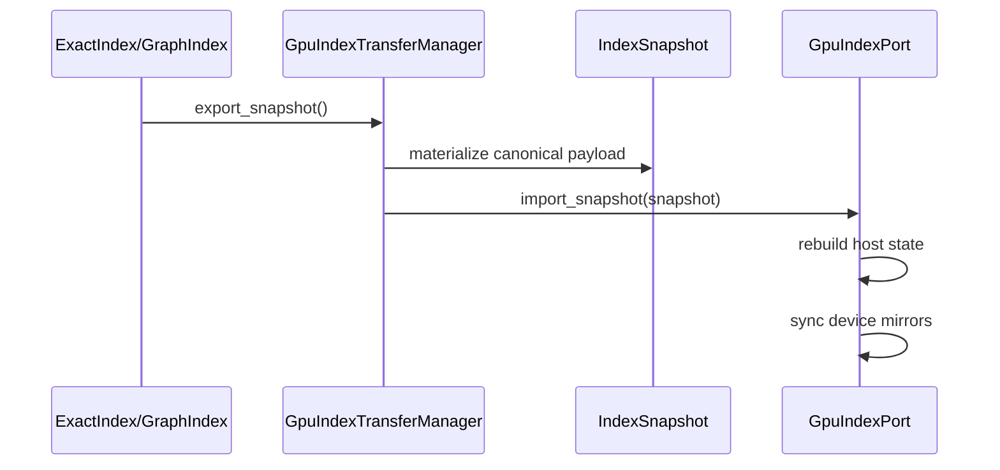
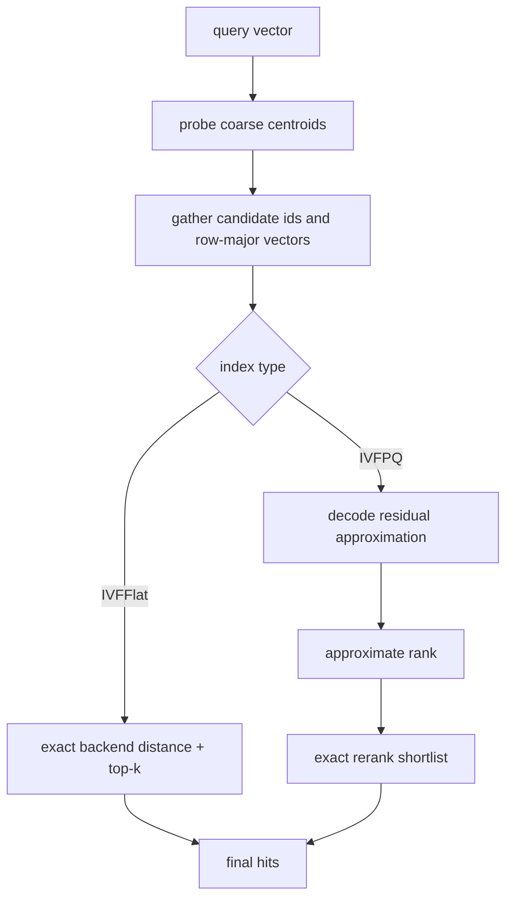
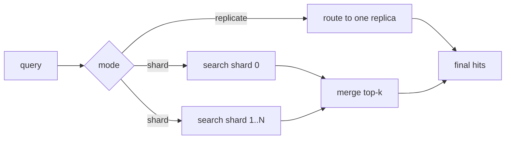

# FAISS GPU Acceleration Analysis and Elips Implementation Design

This document is a source-level analysis of FAISS CPU and GPU index internals
and the corresponding GPU acceleration layer implemented in Elips.

The FAISS side of this document is grounded in the following upstream sources:

- `faiss/gpu/StandardGpuResources.cpp`
- `faiss/gpu/GpuCloner.cpp`
- `faiss/gpu/GpuIndex.cu`
- `faiss/gpu/GpuIndexFlat.cu`
- `faiss/gpu/GpuIndexIVF.cu`
- `faiss/gpu/GpuIndexIVFFlat.cu`
- `faiss/gpu/GpuIndexIVFPQ.cu`
- `faiss/IndexFlat.cpp`
- `faiss/IndexIVF.cpp`
- `faiss/IndexIVFPQ.cpp`
- `faiss/impl/ProductQuantizer.cpp`
- `faiss/VectorTransform.cpp`
- `faiss/IndexHNSW.cpp`
- `faiss/IndexBinaryFlat.cpp`
- `faiss/IndexReplicas.cpp`
- `faiss/IndexShards.cpp`

The Elips side is grounded in these implementation units:

- [`include/elips/index_engine/IndexSnapshot.hpp`](/Users/kuroyami/ellips/include/elips/index_engine/IndexSnapshot.hpp)
- [`include/elips/index_engine/IndexTransferPort.hpp`](/Users/kuroyami/ellips/include/elips/index_engine/IndexTransferPort.hpp)
- [`src/gpu_engine/GpuIndexTransferManager.cpp`](/Users/kuroyami/ellips/src/gpu_engine/GpuIndexTransferManager.cpp)
- [`src/gpu_engine/detail/IvfIndexState.cpp`](/Users/kuroyami/ellips/src/gpu_engine/detail/IvfIndexState.cpp)
- [`src/gpu_engine/GpuBruteForceIndex.cpp`](/Users/kuroyami/ellips/src/gpu_engine/GpuBruteForceIndex.cpp)
- [`src/gpu_engine/GpuIVFFlatIndex.cpp`](/Users/kuroyami/ellips/src/gpu_engine/GpuIVFFlatIndex.cpp)
- [`src/gpu_engine/GpuIVFPQIndex.cpp`](/Users/kuroyami/ellips/src/gpu_engine/GpuIVFPQIndex.cpp)
- [`src/gpu_engine/GpuGraphIndex.cpp`](/Users/kuroyami/ellips/src/gpu_engine/GpuGraphIndex.cpp)
- [`src/gpu_engine/GpuHybridIndex.cpp`](/Users/kuroyami/ellips/src/gpu_engine/GpuHybridIndex.cpp)
- [`src/gpu_engine/GpuDistributedIndex.cpp`](/Users/kuroyami/ellips/src/gpu_engine/GpuDistributedIndex.cpp)
- [`src/ExactIndex.cpp`](/Users/kuroyami/ellips/src/ExactIndex.cpp)
- [`src/HierarchicalGraphIndex.cpp`](/Users/kuroyami/ellips/src/HierarchicalGraphIndex.cpp)

## 1. FAISS Core Architecture

### 1.1 Architectural split

FAISS is not a single index implementation with optional GPU branches. It is a
two-family system:

- CPU indexes derive from CPU `Index` implementations such as `IndexFlat`,
  `IndexIVF`, `IndexIVFPQ`, `IndexHNSW`, `IndexBinaryFlat`, and composite
  wrappers such as `IndexReplicas` and `IndexShards`.
- GPU indexes derive from `GpuIndex` and live in separate classes such as
  `GpuIndexFlat`, `GpuIndexIVFFlat`, `GpuIndexIVFPQ`, and
  `GpuIndexIVFScalarQuantizer`.

This split is not cosmetic. The GPU indexes use different resource ownership,
different memory layouts, and different search pipelines. FAISS therefore treats
CPU->GPU movement as cloning, not as a runtime flag on the same object.

### 1.2 End-to-end lifecycle

FAISS index lifecycle, simplified:

1. Construct an index with metric, dimensionality, and algorithm-specific
   parameters.
2. Train the index if the algorithm requires learned state.
3. Add vectors, optionally in blocks, and optionally with explicit ids.
4. Search, often in two stages:
   coarse routing -> list scan or graph walk -> top-k merge.
5. Reconstruct, serialize, clone, shard, or replicate as needed.

For IVF-derived structures the full data flow is:

1. Train level-1 coarse quantizer.
2. If residual coding is used, assign training vectors to coarse centroids and
   compute residuals.
3. Train the encoder over residuals or raw vectors.
4. During add, assign each vector to a coarse list.
5. Encode the vector payload for the list representation.
6. Append `(id, code)` into the inverted list.
7. During search, probe `nprobe` coarse lists, scan codes, and merge heaps.

## 2. FAISS CPU Index Internals

### 2.1 Flat indexes

`IndexFlat` is the canonical exact baseline.

- Data layout: contiguous row-major float storage exposed through `get_xb()`.
- Search: dispatches to `knn_inner_product`, `knn_L2sqr`, or metric-specific
  distance routines over the full matrix.
- Range search: similar full scan, no coarse pruning.
- Reconstruction: direct copy from the row-major buffer.
- Serialization: straightforward because the representation is raw vectors.

`IndexFlatL2` adds optional cached L2 norms for faster L2 search. This is an
important FAISS pattern: the public index type remains simple while
metric-specific fast paths are layered in below it.

### 2.2 IVF base

`IndexIVF` is the shared base for inverted-file indexes.

Core fields and invariants:

- `quantizer`: the level-1 routing index.
- `nlist`: number of coarse cells.
- `nprobe`: number of coarse cells probed at query time.
- `invlists`: per-list storage for codes and ids.
- `code_size`: bytes stored per vector in the list payload.
- `direct_map`: optional id -> `(list, offset)` mapping for reconstruction and
  updates.

Actual add path in `IndexIVF::add_core`:

1. Optionally block input into chunks of `65536` vectors.
2. Require precomputed `coarse_idx`.
3. Encode vectors into a flat byte buffer with `encode_vectors`.
4. Parallelize by list ownership: each thread handles vectors whose list id is
   congruent to its rank modulo thread count.
5. Append encoded bytes to `invlists`.
6. Update `direct_map`.

Actual search path in `IndexIVF::search`:

1. Query the coarse quantizer for `nprobe` assignments.
2. Prefetch the selected lists.
3. Call `search_preassigned`.

`search_preassigned` is the real workhorse:

- It creates an `InvertedListScanner`.
- It scans either list iterators or materialized list arrays.
- It supports per-list id filtering, `max_codes`, and heap merging.
- It handles multiple parallelization modes.
- It maintains separate heap policies for inner-product and L2 semantics.

This is why FAISS IVF is extensible: the coarse-routing and probe orchestration
live in the base class, while the actual code interpretation lives in the
scanner.

### 2.3 IVFFlat

`IndexIVFFlat` is IVF with raw vector payloads in the lists.

- Data layout: list payload code size is `d * sizeof(float)`.
- Training requirements: only coarse quantizer training.
- Add: store raw vectors inside the target inverted list.
- Search: scan the selected lists and compute exact distances.
- Tradeoff: lower compression than IVFPQ or IVFSQ, higher recall and simpler
  reconstruction.

### 2.4 IVFPQ

`IndexIVFPQ` is FAISS' canonical compressed IVF index.

Important implementation details:

- Training:
  - `IndexIVFPQ::train_encoder` calls `pq.train`.
  - If `by_residual` is enabled, it precomputes lookup tables afterward.
- Encoder training size:
  - `train_encoder_num_vectors` is `pq.cp.max_points_per_centroid * pq.ksub`.
- Add:
  - `add_core` delegates to `add_core_o`.
  - `add_core_o` blocks input in chunks of `32768`.
  - Residuals are computed against the coarse centroid if `by_residual` is on.
  - `pq.compute_codes` encodes residuals.
  - Encoded bytes and ids are appended to the target list.
- Decode:
  - `sa_decode` reconstructs the PQ residual, then adds the coarse centroid
    back if residual mode is enabled.

The important architectural point is that IVFPQ is not just "IVF plus small
codes". It is a real two-level factorization:

- coarse partitioning by centroid
- fine residual coding by product quantization

### 2.5 IVFSQ

The scalar-quantized IVF family follows the same `IndexIVF` orchestration but
stores scalar-quantized payloads rather than PQ codes. It shares the same
coarse-routing structure and inverted-list mechanics, but uses a different
payload codec and distance scanner.

Elips does not implement a GPU IVFSQ equivalent in this pass, but the FAISS
architecture makes clear where it belongs: as another leaf on top of common IVF
state rather than as a separate search framework.

### 2.6 Product Quantization

`ProductQuantizer` in `impl/ProductQuantizer.cpp` is materially more complex
than a toy subspace hash:

- It requires `d % M == 0`.
- It defines `dsub = d / M`, `ksub = 1 << nbits`, and `code_size`.
- Training runs k-means per subspace unless `Train_shared` is selected.
- Hypercube, PCA-hypercube, and hot-start initialization modes exist.
- `compute_code` can use either the regular centroid layout or a transposed
  centroid layout.
- `sync_transposed_centroids` materializes an alternative memory layout used by
  fast code-distance paths.

This is a crucial design lesson for Elips: real PQ performance comes from both
training quality and memory layout optimization, not just from compressing
vectors.

### 2.7 OPQ

`OPQMatrix` in `VectorTransform.cpp` is an iterative optimization that learns a
rotation before PQ:

1. Center input data.
2. Initialize or reuse a rotation matrix.
3. Alternate between:
   - projecting vectors through the current rotation
   - training PQ on the projected space
   - reconstructing PQ outputs
   - solving a Procrustes-style update for the rotation

This is why OPQ exists as a transform rather than as a special-case index: FAISS
keeps vector transforms composable and separate from index ownership.

### 2.8 HNSW

`IndexHNSW` separates graph routing from payload storage:

- `storage` holds the underlying vectors.
- The HNSW graph is layered and navigated independently.
- `add` first appends to `storage`, then updates graph links.
- Search descends from upper layers, then expands at level 0.
- Extra maintenance functions exist for shrinking neighbors, initializing from
  k-NN graphs, and reordering links.

This separation matters for Elips because it justifies a correctness-first GPU
graph path that can preserve a CPU graph as authoritative topology while
mirroring vectors on device.

### 2.9 Binary indexes

`IndexBinaryFlat` stores bytes in a contiguous `xb` array and performs Hamming
distance search. The representation is distinct enough from float-vector
indexes that it should be treated as its own family.

### 2.10 Composite indexes

FAISS uses composition for higher-level behaviors:

- `IndexReplicas`: replicate full sub-indexes and partition queries across
  them.
- `IndexShards`: partition vectors across sub-indexes and merge results.
- `IndexPreTransform`: prepend learned transforms such as OPQ.
- `IndexIDMap`: attach or remap ids around a base index.

This is directly relevant to multi-GPU design: FAISS does not embed multi-GPU
logic inside each leaf index. It composes independent indexes at a higher
level.

## 3. FAISS GPU Resource Architecture

### 3.1 StandardGpuResources

`StandardGpuResourcesImpl` is the central GPU runtime object.

It owns:

- per-device default streams
- per-device async copy streams
- per-device alternate streams
- per-device cuBLAS handles
- a per-device temporary memory stack
- a shared pinned host allocation for staged CPU<->GPU copies
- allocation bookkeeping keyed by device and pointer

It supports three memory spaces:

- temporary stack memory
- device allocations
- unified memory allocations

Key implementation behaviors from `StandardGpuResources.cpp`:

- `setTempMemory` rebuilds per-device stack allocators.
- `initializeForDevice` lazily creates streams, pinned memory, cuBLAS handles,
  and temp-memory stacks.
- `setDefaultStream` and `revertDefaultStream` preserve ordering by inserting
  stream waits when the user changes the stream.
- `allocMemory` routes temporary allocations to the stack first, then falls
  back to device allocations on overflow.
- allocations are aligned to `256` bytes.

This is the architectural heart of FAISS GPU acceleration: indexes do not own
raw CUDA streams or ad-hoc scratch buffers. They borrow them from a reusable
resource layer.

### 3.2 Why this layer exists

The resource layer solves five problems simultaneously:

1. repeated add/search calls need reusable scratch memory
2. CPU-resident queries need pinned staging buffers
3. async copies must be ordered independently from compute
4. BLAS handles and streams must be scoped to the right device
5. multiple index objects should not each allocate their own scratch pools

## 4. FAISS GPU Index Architecture

### 4.1 GpuIndex base

`GpuIndex` provides the shared CPU/GPU boundary behaviors:

- common metadata copy in `copyFrom` and `copyTo`
- paged add in `addPaged_ex_`
- CPU-to-device staging in `addPage_ex_`
- paged CPU query search in `searchFromCpuPaged_ex_`

The paged search path is especially important. If the query matrix resides on
CPU and exceeds a threshold, FAISS does not attempt a single monolithic upload.
Instead it:

1. determines a page size from pinned memory capacity
2. stages CPU pages into pinned host buffers
3. asynchronously copies pinned pages to GPU buffers
4. overlaps copy and compute through a double-buffered or triple-buffered
   pipeline
5. writes top-k results back to host output buffers

This is how FAISS avoids coupling search correctness to GPU memory capacity.

### 4.2 GpuIndexFlat

`GpuIndexFlat` is the simplest GPU leaf:

- `copyFrom` resets device storage and uploads raw vectors
- `copyTo` reconstructs a CPU `IndexFlat`
- the internal storage layout is GPU-native rather than the CPU `xb` pointer

The class exists separately because the CPU and GPU storage containers are
different even though the algorithm is "flat" in both cases.

### 4.3 GpuIndexIVF

`GpuIndexIVF` is the GPU analog of the shared IVF base.

Important behaviors:

- `copyFrom` clones or reuses the coarse quantizer.
- If the CPU coarse quantizer is unsupported on GPU and
  `allowCpuCoarseQuantizer` is enabled, it falls back to a CPU quantizer.
- `copyTo` reconstructs a CPU `IndexIVF` and converts the coarse quantizer
  through `index_gpu_to_cpu`.
- `trainQuantizer_` often still uses CPU `Clustering`, even for GPU-serving
  indexes.

This is a critical design point: FAISS GPU search does not imply fully GPU
training. The system is willing to keep CPU algorithms in the training path if
they are already robust.

### 4.4 GpuIndexIVFFlat

`GpuIndexIVFFlat` adds the raw-vector IVF leaf on top of `GpuIndexIVF`.

Real implementation details:

- `reserveMemory` reserves list capacity up front.
- `copyFrom` copies coarse state first, then copies inverted lists.
- `copyTo` requires retained ids; it cannot round-trip if the GPU index was
  configured with `INDICES_IVF`.
- Non-cuVS training path:
  - move training data to host
  - run `trainQuantizer_`
  - construct GPU IVF storage
  - push quantizer state into the GPU index

### 4.5 GpuIndexIVFPQ

`GpuIndexIVFPQ` adds compressed IVF on top of `GpuIndexIVF`.

Important implementation constraints in FAISS:

- `pq.nbits == 8` unless using an interleaved layout path
- `by_residual` must be true
- polysemous codes are not supported in the GPU version

Important behaviors:

- `copyFrom` imports PQ centroids and inverted lists
- `copyTo` reconstructs CPU `ProductQuantizer` centroids and list contents
- non-cuVS training path:
  - move training data to host
  - train the coarse quantizer
  - train the residual quantizer
  - construct GPU IVFPQ storage
  - optionally precompute lookup tables

This is the template Elips followed: shared IVF state plus a separate residual
quantization layer.

## 5. FAISS CPU <-> GPU Cloning and Multi-GPU

### 5.1 CPU <-> GPU cloning

`GpuCloner.cpp` is not optional utility code. It is a first-class subsystem.

Important concepts:

- `ToGpuCloner` maps CPU leaf indexes to GPU leaf indexes.
- `ToCPUCloner` reverses the process.
- `GpuClonerOptions` controls float16, lookup tables, retained ids, reserve
  capacity, and CPU coarse-quantizer fallback.
- `index_cpu_to_gpu` and `index_gpu_to_cpu` are thin front doors into the
  cloners.

The architecture consequence is straightforward: if CPU and GPU indexes are
different classes, then migration must be an explicit protocol with its own
policy surface.

### 5.2 Multi-GPU composition

FAISS handles multiple GPUs with composition objects rather than bespoke
multi-device logic inside each leaf index.

`ToGpuClonerMultiple` supports two broad strategies:

- replication:
  - clone the same index onto each device
  - wrap them in `IndexReplicas`
- sharding:
  - split the dataset or IVF lists across devices
  - wrap them in `IndexShards` or `IndexShardsIVF`

`copy_ivf_shard` supports multiple partitioning modes:

- contiguous id ranges
- modulo-based partitioning
- inverted-list-range partitioning

At runtime:

- `IndexReplicas::search` partitions queries across replicas.
- `IndexShards::search` sends the same query batch to all shards and merges the
  top-k outputs.

This exact split shaped Elips' `GpuDistributedIndex`.

## 6. FAISS Design Principles Extracted

### 6.1 CPU and GPU indexes are different objects

Reasons:

- resource ownership differs
- memory layouts differ
- some training paths stay on CPU
- some GPU paths retain less metadata than CPU indexes
- GPU search often requires batching, staging, or layout-specific kernels

### 6.2 Resource layers should be centralized

FAISS avoids per-index reinvention of:

- temporary allocations
- staging memory
- default and copy streams
- BLAS handles
- allocation bookkeeping

### 6.3 IVF should be split into shared routing state plus leaf payload codecs

The common elements are:

- centroid training
- vector-to-list assignment
- probing
- list selection

The leaf-specific elements are:

- raw vector payloads
- PQ codes
- SQ codes
- scanner behavior

### 6.4 Multi-GPU should be compositional

Leaf indexes should remain single-device components. Replication and sharding
are higher-order wrappers with their own merge policies and id semantics.

### 6.5 Paging is part of the API contract

Large add/search calls must work even when the host batch does not fit in GPU
memory. FAISS solves this in the base GPU class, not in each leaf index.

## 7. Elips Architecture Implemented in This Pass

### 7.1 Snapshot-based transfer layer

Elips now has a canonical transfer format:

```cpp
struct IndexSnapshot {
    IndexSnapshotKind kind;
    Metric metric;
    std::uint16_t dimension;
    std::vector<RecordID> ids;
    std::vector<float> vectors;
    std::optional<IvfSnapshot> ivf;
    std::optional<PqSnapshot> pq;
};
```

This is implemented in [`IndexSnapshot.hpp`](/Users/kuroyami/ellips/include/elips/index_engine/IndexSnapshot.hpp).

The key design choice is that raw vectors remain the source of truth. This
matches FAISS' willingness to rebuild algorithm-native state during cloning
rather than demanding byte-identical topology transfer for every index type.

`IndexTransferPort` exposes:

- `export_snapshot()`
- `import_snapshot(const IndexSnapshot&)`

Both `ExactIndex` and `HierarchicalGraphIndex` now implement it.

### 7.2 Transfer manager

`GpuIndexTransferManager` is Elips' equivalent of the FAISS cloner front door.

Current behavior:

- CPU -> GPU: export snapshot from CPU transfer port, import into GPU index
- GPU -> CPU: export snapshot from GPU index, import into CPU transfer port
- generic clone: transfer between any two snapshot-capable indexes

This is intentionally simpler than FAISS `GpuClonerOptions`, but the structural
pattern is the same.

### 7.3 Shared IVF state

`detail::IvfIndexState` is the Elips analog of FAISS' shared IVF machinery.

It owns:

- metric and dimension
- requested and active list counts
- `nprobe`
- row-major host vectors
- row-major centroids
- vector -> list assignments
- per-list membership arrays
- id -> slot map
- device mirrors for vectors and centroids

It implements:

- centroid training
- vector assignment
- insert/remove bookkeeping
- batch build
- snapshot import/export
- list probing through the backend distance and top-k ports
- candidate gathering for reranking

This is the key architectural step that removed stub duplication from
`GpuIVFFlatIndex` and `GpuIVFPQIndex`.

### 7.4 GPU leaf indexes

Implemented leaf and wrapper behavior:

- `GpuBruteForceIndex`
  - real host/device mirror
  - snapshot import/export
  - CPU transfer support
- `GpuIVFFlatIndex`
  - shared IVF training and assignments
  - coarse-list probing
  - candidate gather
  - exact rerank over candidates
- `GpuIVFPQIndex`
  - shared IVF routing
  - residual PQ codebook training
  - code encoding
  - approximate rank on decoded residual reconstructions
  - exact rerank of shortlisted candidates
- `GpuGraphIndex`
  - CPU graph as authoritative topology
  - device mirror for vectors
  - snapshot and transfer support
  - no dummy search path anymore
- `GpuHybridIndex`
  - selects the underlying GPU leaf from `GpuConfig.algorithm`
  - keeps a CPU mirror index synchronized through snapshots
- `GpuDistributedIndex`
  - `replicate` mode for FAISS-style replicas
  - `shard` mode for FAISS-style shards
  - merge logic for search and search-batch

### 7.5 Class hierarchy



## 8. Elips Execution and Memory Flow

### 8.1 CPU -> GPU clone flow



### 8.2 IVF/PQ search flow in Elips



### 8.3 Distributed search flow



### 8.4 Snapshot memory layout

- `vectors`: row-major float payload `[n][d]`
- `ids`: parallel vector aligned with `vectors`
- `IvfSnapshot.centroids`: row-major float payload `[nlist][d]`
- `IvfSnapshot.assignments`: vector slot -> list id
- `PqSnapshot.codebook`: row-major float payload `[pq_dim][ksub][dsub]`
- `PqSnapshot.codes`: byte payload `[n][pq_dim]`

## 9. API Surface Added or Reworked

### 9.1 Transfer API

```cpp
class IndexTransferPort {
public:
    virtual std::expected<IndexSnapshot, std::string>
    export_snapshot() const = 0;

    virtual std::expected<void, std::string>
    import_snapshot(const IndexSnapshot& snapshot) = 0;
};
```

### 9.2 GPU index API

```cpp
class GpuIndexPort : public elips::IndexPort, public elips::IndexTransferPort {
public:
    virtual std::expected<void, GpuError>
    build_from_batch(std::span<const float> vectors,
                     std::span<const RecordID> ids,
                     const GpuIndexBuildParams& params) = 0;

    virtual std::expected<std::vector<std::vector<SearchResult>>, GpuError>
    search_batch(std::span<const float> queries, size_t k, size_t ef_search) const = 0;

    virtual std::expected<void, GpuError>
    export_to_cpu_index(elips::IndexPort& cpu_index_out) const = 0;

    virtual std::expected<void, GpuError>
    import_from_cpu_index(const elips::IndexPort& cpu_index) = 0;
};
```

## 10. Critical Pseudocode

### 10.1 Snapshot clone

```text
function clone(source, destination):
    snapshot = source.export_snapshot()
    if snapshot is error:
        return error
    return destination.import_snapshot(snapshot)
```

### 10.2 Elips IVFFlat search

```text
function ivf_flat_search(query, k):
    if index empty:
        return []

    if state is trained:
        lists = probe_lists(query, nprobe)
        candidates = gather_candidates(lists)
    else:
        candidates = all_candidates()

    distances = backend.compute_distances(query, candidates.vectors)
    return backend.top_k_map_ids(distances, candidates.ids, k)
```

### 10.3 Elips IVFPQ build

```text
function ivfpq_build(vectors, ids):
    state.build_from_batch(vectors, ids)
    residuals = vectors - centroid(assignments)
    codebook = train_subspace_kmeans(residuals, pq_dim, pq_bits)
    codes = encode_residuals(residuals, codebook)
```

### 10.4 Elips IVFPQ search

```text
function ivfpq_search(query, k):
    candidates = gather_candidates_from_probed_lists(query)
    if no codebook:
        return exact_rank(candidates)

    approx = []
    for candidate in candidates:
        decoded = decode(code(candidate.slot), centroid(candidate.list))
        approx.append(distance(query, decoded), candidate.slot)

    shortlist = best min(len(approx), max(k * 4, k)) candidates by approx distance
    return exact_rank(raw_vectors(shortlist), k)
```

### 10.5 Elips distributed search

```text
function distributed_search(query, k):
    if mode == replicate:
        return next_replica().search(query, k)

    partials = []
    for shard in shards:
        partials += shard.search(query, k)
    return top_k_merge(partials, k)
```

## 11. Benchmarking Strategy

### 11.1 Metrics

- build throughput: vectors/sec
- search latency: p50, p95, p99
- search throughput: queries/sec
- recall@k against `ExactIndex`
- memory footprint:
  - host bytes
  - device bytes
  - snapshot bytes
- transfer cost:
  - CPU -> GPU clone latency
  - GPU -> CPU clone latency

### 11.2 Workloads

- small exact workload for correctness
- medium clustered workload for IVF/PQ
- skewed list-size workload for probe imbalance
- large batch workload for backend distance/top-k amortization
- shard/replica workloads with mixed query concurrency

### 11.3 Comparisons

- `ExactIndex` vs `GpuBruteForceIndex`
- `GpuBruteForceIndex` vs `GpuIVFFlatIndex`
- `GpuIVFFlatIndex` vs `GpuIVFPQIndex`
- single-device vs distributed shard mode
- distributed shard vs distributed replicate under concurrent queries

## 12. Testing Strategy

Implemented coverage in this pass:

- [`tests/unit/gpu/GpuBruteForceIndexTest.cpp`](/Users/kuroyami/ellips/tests/unit/gpu/GpuBruteForceIndexTest.cpp)
- [`tests/unit/gpu/GpuAdvancedIndexTest.cpp`](/Users/kuroyami/ellips/tests/unit/gpu/GpuAdvancedIndexTest.cpp)

Covered behaviors:

- brute-force host/device mirror behavior
- IVFFlat snapshot round-trip
- IVFFlat CPU/GPU transfer round-trip
- IVFPQ snapshot round-trip
- graph import/search/export path
- hybrid CPU mirror synchronization
- distributed shard merge behavior
- distributed replica logical-size semantics

Recommended next tests:

- recall regression suite with randomized corpora
- batch-search parity for IVFFlat and IVFPQ
- failure-path tests for snapshot dimension/metric mismatch
- backend-level tests for future real temporary memory pools and streams
- performance regression benchmarks gated in CI

## 13. Migration Strategy from Existing Elips Indexes

### 13.1 Exact -> GPU

1. Export `ExactIndex` snapshot.
2. Import into `GpuBruteForceIndex`, `GpuIVFFlatIndex`, or `GpuIVFPQIndex`.
3. Keep the snapshot as a canonical host checkpoint.
4. Use `GpuHybridIndex` if CPU mirror retention is required.

### 13.2 Graph -> GPU

1. Export active vectors from `HierarchicalGraphIndex`.
2. Import into `GpuGraphIndex`.
3. Rebuild authoritative graph topology on CPU inside the GPU wrapper.
4. Mirror vector payloads on device.

### 13.3 Multi-GPU

1. Build single-device child GPU indexes first.
2. Compose them into `GpuDistributedIndex`.
3. Choose `replicate` for throughput and `shard` for capacity.
4. Persist via merged snapshots or shard-local child snapshots, depending on the
   future orchestration layer.

## 14. Risks, Limitations, and Tradeoffs

### 14.1 What is now production-shaped

- explicit transfer protocol
- reusable shared IVF state
- non-stub IVFFlat and IVFPQ implementations
- correctness-first graph wrapper
- shard/replica composition type
- test coverage for the new snapshot and GPU index paths

### 14.2 Gaps relative to FAISS

- Elips does not yet have a `StandardGpuResources` equivalent with:
  - real temp-memory stacks
  - pinned host pools
  - separate default and async copy streams
  - backend-level allocation bookkeeping
- `GpuGraphIndex` is not a true GPU graph traversal implementation.
- `GpuIVFFlatIndex` and `GpuIVFPQIndex` use generic backend distance and top-k
  calls, not FAISS-grade specialized kernels.
- `GpuDistributedIndex` is implemented but not yet wired into `IndexFactory`,
  `Config`, or `Database` policy selection.
- snapshot metadata does not yet encode distributed topology mode.
- Elips currently implements IVF flat and IVF PQ, but not GPU IVFSQ or binary
  GPU indexes.

### 14.3 Design tradeoffs accepted in this pass

- raw vectors remain the canonical cross-device transfer payload even when a
  native structure could theoretically be copied more compactly
- graph serving prioritizes correctness and topology reuse over full GPU
  traversal
- PQ training is materially improved over the previous stub, but still far
  simpler than FAISS residual/PQ optimization and kernel specialization
- multi-GPU composition exists as an explicit API type before full runtime
  policy integration

## 15. Recommended Next Implementation Steps

1. Introduce a real `GpuResources` layer in Elips with temp memory, staged host
   memory, and stream separation.
2. Move CPU-paged add/search orchestration into a common GPU base path, similar
   to FAISS `GpuIndex`.
3. Add backend-specialized kernels for:
   - centroid probing
   - fused distance + top-k
   - PQ LUT evaluation
4. Add IVFSQ if compressed exact-ish search is needed.
5. Add config-driven distributed construction and persistence topology metadata.
6. Add recall/performance CI to keep approximate index quality measurable.
