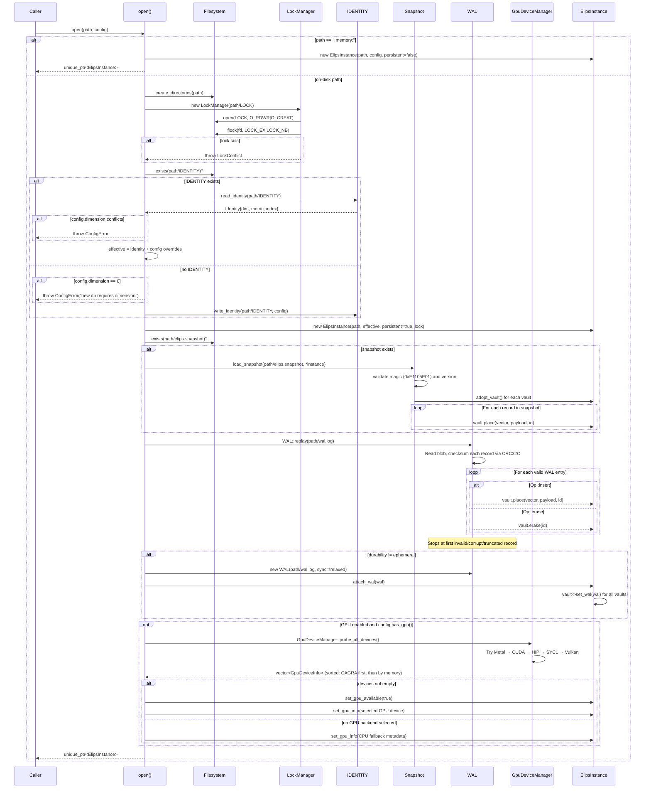
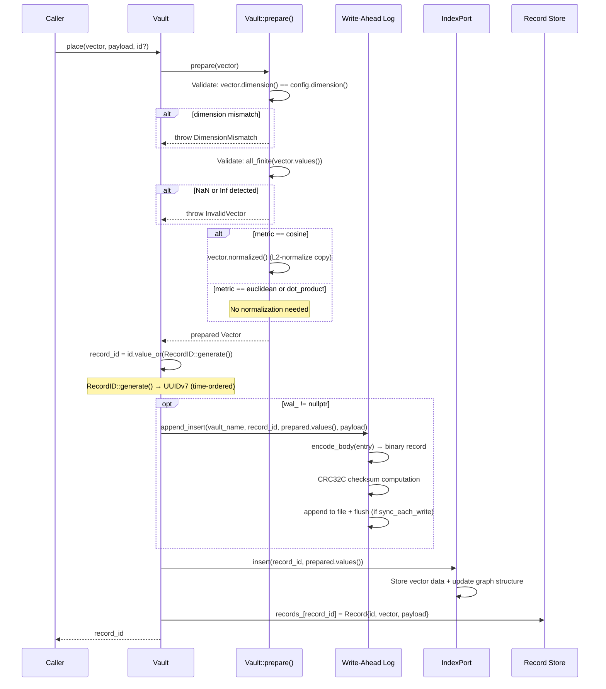
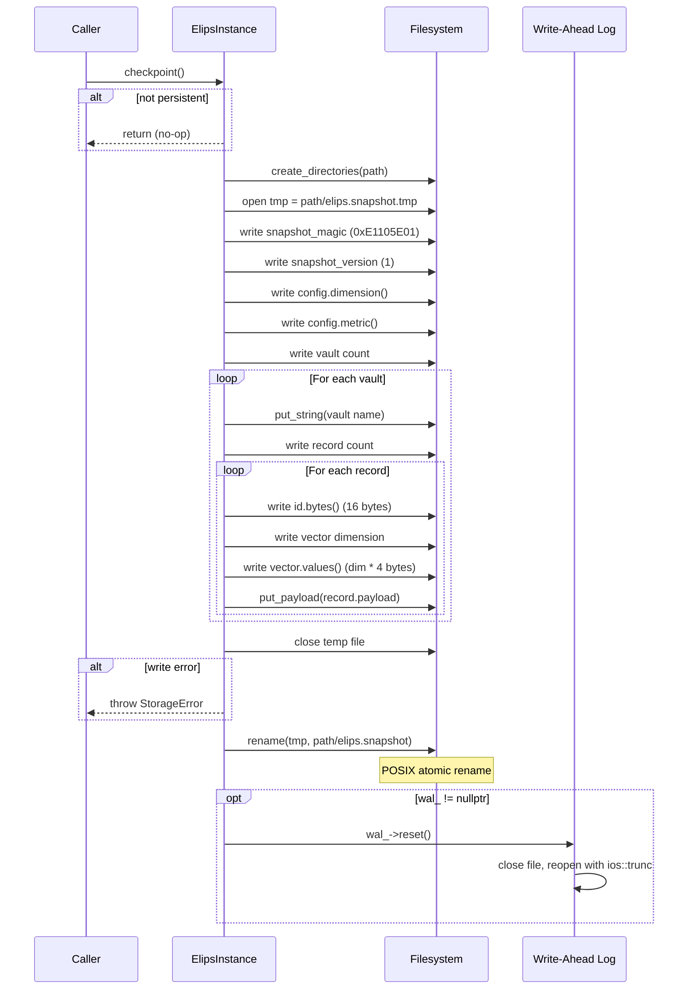

# ELIPS Runtime Flow

This document describes the complete runtime lifecycle of an ELIPS database instance, from `open()` through writes, reads, transactions, checkpointing, and shutdown.

## 1. open() Sequence



### Step-by-step breakdown:

1. **Path Resolution**: If `path == ":memory:"`, create an in-memory instance (`persistent_=false`). No filesystem operations.

2. **Lock Acquisition**: For on-disk databases, `LockManager` opens (or creates) the `LOCK` file and acquires an exclusive, non-blocking advisory lock via `flock(fd, LOCK_EX | LOCK_NB)`. If another writer holds the lock, `LockConflict` is thrown immediately.

3. **IDENTITY Read/Write**: 
   - If `IDENTITY` file exists: read the persisted dimension, metric, and index type. If the caller's config specifies a conflicting dimension, throw `ConfigError`. Merge persisted identity with caller's config (persisted values take precedence, but caller's graph_params and durability are used).
   - If `IDENTITY` does not exist: write it with the caller's config. Requires a non-zero dimension.

4. **Snapshot Load**: If `elips.snapshot` exists:
   - Validate magic bytes (`0xE1105E01`) and version.
   - For each vault: create a `Vault` object, deserialize all records (ID bytes, dimension, vector float array, payload), and call `vault.place()` to insert into the index and record store.
   - Vaults are adopted into the instance via `adopt_vault()`.

5. **WAL Replay**: `WAL::replay()` reads the entire `wal.log` as a blob:
   - For each record: validate CRC32C checksum against the stored CRC.
   - On magic mismatch, checksum mismatch, or truncation: stop cleanly (no partial apply).
   - Replay insert/erase operations on top of the already-loaded snapshot.

6. **WAL Attach**: If durability is not `ephemeral`, create a new `WAL` instance (opening the log file in append mode). The sync behavior depends on durability: `standard`/`paranoid` flush on every write; `relaxed` does not. Attach the WAL to the instance and all vaults via `attach_wal()`.

7. **GPU Detection** (optional): If `ELIPS_GPU_ENABLED` and the config enables GPU, `GpuDeviceManager::probe_all_devices()` tries each compile-time-enabled backend in order: Metal → CUDA → HIP → SYCL → Vulkan. Results are sorted by CAGRA support then memory capacity. If at least one device is found, it's stored on the instance.

## 2. Write Path



### Write Path Details:

1. **Vault::prepare()**: 
   - Dimension validation: `vector.dimension() != config_.dimension()` → `DimensionMismatch`.
   - Finiteness check: `!std::isfinite(v)` → `InvalidVector`.
   - Cosine normalization: If the metric is `cosine`, the vector is L2-normalized (`Vector::normalized()`). For `euclidean` and `dot_product`, no normalization.

2. **RecordID Generation**: If no explicit ID is provided, `RecordID::generate()` creates a UUIDv7 — 128-bit, time-ordered (lexicographic byte order matches insertion order).

3. **WAL Append** (before memory mutation): 
   - `wal_->append_insert()` serializes the entry as: magic (4 bytes) + opcode (1 byte) + vault name (len-prefixed string) + record ID (16 bytes) + vector dimension (2 bytes) + vector data (dim * 4 bytes) + payload (tagged binary). 
   - A CRC32C checksum is computed over the body and appended.
   - If `sync_each_write` is true (standard/paranoid durability), `out_.flush()` hands the data to the OS before acknowledging.

4. **Index Insert**: `index_->insert(id, values)` stores the vector in the index data structure. For HNSW, this involves probabilistic level assignment, greedy layer descent, beam search, and diversity-based neighbor connection.

5. **Record Store Update**: The in-memory `records_` map is updated with the prepared vector and payload.

## 3. Read Path

### Vault::seek() Flow:

```
Vault::seek(query, top, filter, threshold)
  │
  ├─ Vault::prepare(query)
  │   ├─ Validate dimension
  │   ├─ Validate finite values
  │   └─ Normalize (cosine only)
  │
  ├─ Determine fetch count:
  │   ├─ threshold set → fetch = records_.size() (range query)
  │   ├─ filter active → fetch = min(records_.size(), top * 20)
  │   └─ no filter/threshold → fetch = top
  │   └─ Always clamp to minimum 1
  │
  ├─ index_->search(prepared.values(), fetch)
  │   ├─ ExactIndex: Linear scan + partial_sort
  │   └─ HNSW: Greedy descent + beam search + soft tombstone filter
  │
  ├─ Post-filter loop (for each hit):
  │   ├─ threshold check: dist > threshold → skip
  │   ├─ Metadata filter: filter.matches(record.payload) → skip if fails
  │   ├─ Build SearchResult{id, dist, payload}
  │   └─ Stop when results.size() >= top
  │
  └─ Return vector<SearchResult>
```

Key features of the read path:
- **Overfetch for filtered queries**: When a metadata filter is active, the index fetches `top * 20` candidates so that post-filtering can still yield `top` results.
- **Threshold queries**: Fetch all candidates (`records_.size()`) since a distance threshold is semantically a range query.
- **No index mutation**: Search is `const` — no lock needed for readers in the single-writer model.

### Distance Metrics:

| Metric | Formula | Normalized? | Smaller = Closer? |
|--------|---------|-------------|--------------------|
| cosine | `1 - dot(a, b)` | Yes (L2 on ingest) | Yes |
| euclidean | `sqrt(sum((a-b)^2))` | No | Yes |
| dot_product | `-dot(a, b)` | No | Yes (negated) |

All metrics are ordering-normalized so that callers always sort ascending (smaller distance = more similar). ARM NEON SIMD kernels provide hardware acceleration on Apple Silicon for both dot product and squared L2 distance.

## 4. Transaction Path

```mermaid
sequenceDiagram
    participant User
    participant DB as ElipsInstance
    participant Txn as Transaction
    participant TV as TransactionVault
    participant V as Vault

    User->>DB: begin_transaction()
    DB-->>User: Transaction{db_}
    
    User->>Txn: vault("my_vault")
    Txn-->>User: TransactionVault{txn_, vault_}

    User->>TV: place(vector, payload, id?)
    TV->>Txn: enqueue_place(vault_name, vector, payload, id)
    Txn->>Txn: Validate dimension (eager)
    Txn->>Txn: Validate finite (eager)
    Txn->>Txn: ops_.push_back(PendingOp{...})
    TV-->>User: record_id (pre-generated)

    User->>TV: erase(id)
    TV->>Txn: enqueue_erase(vault_name, id)
    Txn->>Txn: ops_.push_back(PendingOp{true, ...})

    alt commit
        User->>Txn: commit()
        loop For each PendingOp
            alt is_erase
                Txn->>V: vault.erase(id)
            else insert
                Txn->>V: vault.place(vector, payload, id)
            end
        end
        Txn->>Txn: ops_.clear(); done_ = true
    else rollback
        User->>Txn: rollback()
        Txn->>Txn: ops_.clear(); done_ = true
    else destructor (uncommitted)
        Txn->>Txn: ~Transaction(): rollback() if !done_
    end
```

### Transaction Details:

- **Buffered Operations**: All mutations are buffered in `ops_` (a `std::vector<PendingOp>`). No in-memory state is modified until `commit()`.
- **Eager Validation**: `enqueue_place()` validates dimension and finiteness immediately. This ensures `commit()` can never fail mid-batch (atomicity guarantee).
- **Commit**: Iterates over `ops_` and applies each operation to the actual vaults. Each `vault.place()` or `vault.erase()` triggers WAL append and index mutation. This is a sequential, non-atomic batch — WAL ensures crash safety.
- **Rollback**: Simply clears `ops_` and marks the transaction as done. Buffered operations are discarded without any effect.
- **RAII Auto-Rollback**: The destructor calls `rollback()` if `commit()` was never called, ensuring no orphaned buffered operations.
- **Isolation Level**: Atomic batched writes under the single-writer model. All operations in a transaction are applied in order, with WAL durability. No read-your-writes within the transaction (writes are deferred to commit).
- **TransactionVault**: A lightweight handle that delegates to `Transaction`. Created by `Transaction::vault(name)` and holds a pointer to the parent transaction.

## 5. Checkpoint



### Checkpoint Details:

- **No-op for in-memory**: If `persistent_` is false, checkpoint returns immediately.
- **Temp file write**: All state is serialized to `elips.snapshot.tmp` using the binary serialization primitives in `Serialization.hpp` (native byte order).
- **Atomic publish**: `fs::rename(tmp, snapshot_file)` — on POSIX, rename is atomic. The live snapshot is never in an intermediate state.
- **WAL truncation**: After a successful snapshot, `wal_->reset()` truncates the WAL to zero. All writes are now captured in the snapshot.
- **Automatic on close**: `checkpoint()` is called automatically in `close()` and in the `ElipsInstance` destructor (best-effort, caught exceptions).

## 6. close() / Destructor

```
ElipsInstance::close()
  │
  ├─ if closed_ → return (idempotent)
  ├─ checkpoint()
  │   └─ Serialize all vaults + atomic rename + WAL truncate
  ├─ For each vault: vault->set_wal(nullptr)  // detach before releasing WAL
  ├─ wal_.reset()                            // release WAL ownership
  ├─ lock_.reset()                           // release flock advisory lock
  └─ closed_ = true

ElipsInstance::~ElipsInstance()
  │
  ├─ if persistent_ && !closed_:
  │   └─ try { checkpoint(); } catch (...) { /* suppress */ }
  └─ // destructors must not throw (E.16)
```

## 7. Crash Recovery

When a process crashes and a new process opens the same database directory:

1. **New `open()` call** begins normally.
2. **Lock is acquired**: The crashed process's lock was released by the OS.
3. **IDENTITY is read**: Dimension, metric, index type are validated.
4. **Snapshot is loaded**: The last checkpointed state (all records at that point in time).
5. **WAL is replayed**: `WAL::replay()` reads all valid records from `wal.log` and replays them on top of the snapshot state:
   - Each record is CRC32C-validated.
   - The replay stops at the first invalid record (corrupt tail, truncated write, checksum mismatch).
   - This means: **any write that made it fully into the WAL (with valid CRC) is recovered; partial writes are cleanly dropped.**
6. **New WAL is attached**: A fresh WAL instance is opened in append mode on the same file.

The crash recovery semantics guarantee:
- **No committed data loss**: All writes that were acknowledged (i.e., WAL appended + flushed) are recovered.
- **No partial writes**: CRC32C validation ensures truncated tail records are ignored.
- **Clean restart**: The database is in a consistent state after recovery, identical to the pre-crash memory state.

### WAL Replay Algorithm (WAL::replay):

```
replay(path):
  read entire file as blob
  pos = 0
  while pos < blob.size():
    record_start = pos
    if magic != wal_magic: break          // corrupt start
    parse opcode, vault name, record id
    if op == insert:
      parse dim, vector data, payload
    if stream error: break                 // truncated
    if record_start + body_len + 4 > n: break  // CRC missing
    compute CRC32C over body
    if CRC mismatch: break                 // corrupt record
    entries.push_back(entry)
    pos = record_start + body_len + 4
  return entries
```
